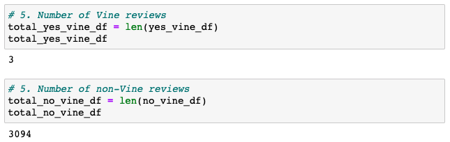
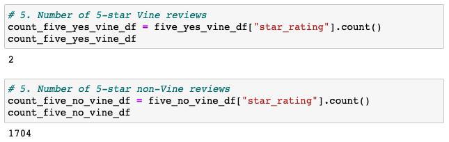
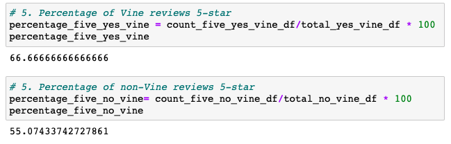

# **Overview of Amazon Vine Analysis**

The purpose of this analysis was to assess Amazon reviews for their products and analyze the reviews written to determine if there is any bias toward favorable reviews from Vine members. The dataset was extracted from [Amazon Review datasets](https://s3.amazonaws.com/amazon-reviews-pds/tsv/index.txt) and the specific dataset used for this analysis was reviews for personal care appliances. After the data was extracted, it was cleaned and transformed using PySpark, and finally connected to an AWS RDS instance. 

# **Results**
* There were only 3 Vine reviews compared to 3094 non-Vine reviews.

* 2 of the Vine reviews were 5-star reviews compared to 1704 of the non-Vine reviews.

* 66.67% of the Vine reviews were 5-star reviews compared to 55.07% of the non-Vine reviews.

# **Summary**
In your summary, state if there is any positivity bias for reviews in the Vine program. Use the results of your analysis to 
support your statement. Then, provide one additional analysis that you could do with the dataset to support your statement.

In our analysis, we observed a slightly higher percentage of 5-star reviews among the Vine reviews compared to the non-Vine reviews (66.67% compared to 55.07%). This shows there could be a potential bias in the Vine reviews. The number of Vine reviews for personal care appliances was very low (n=3) and it would be recommended to conduct a similar analysis on a different dataset to determine if the same trends are observed. In addition to conducting a few additional analysis on different product categories (and ideally with larger sample size), another analysis to support our study is to analyze only verified reviews.
